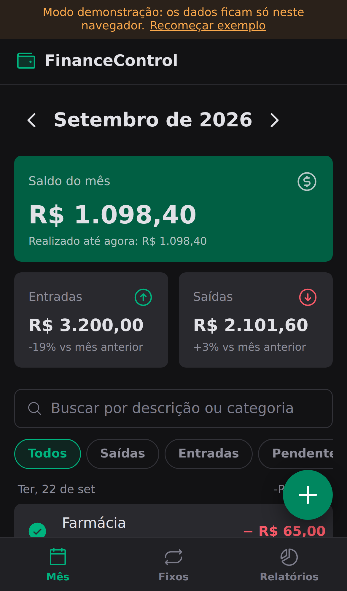
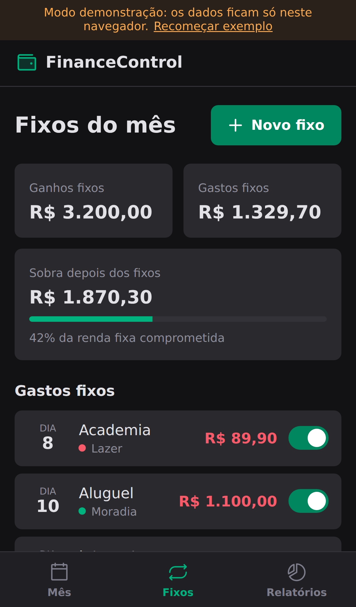
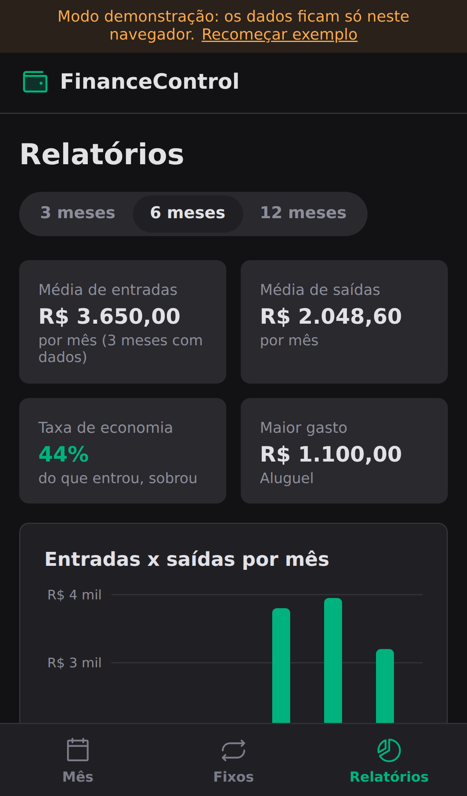
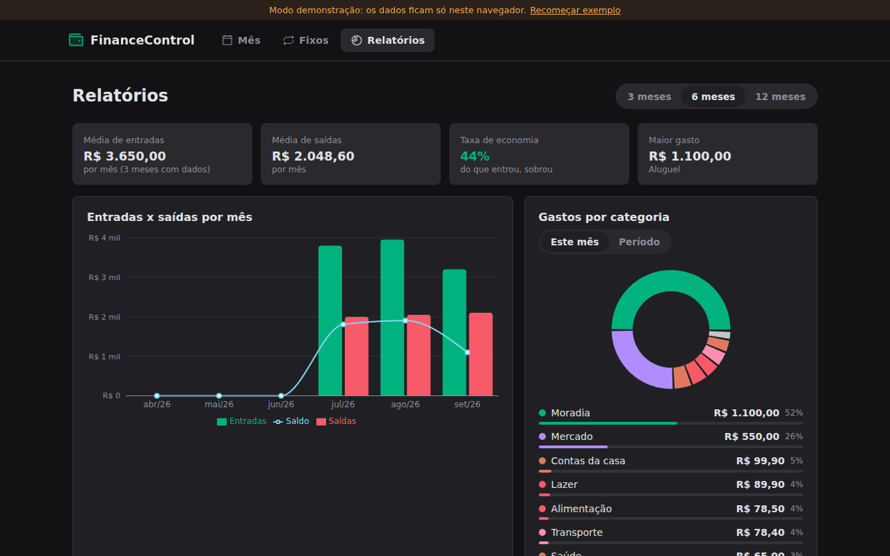

<h1 align="center">💰 FinanceControl</h1>

<p align="center">
  Controle financeiro pessoal para o dia a dia: ganhos e gastos do mês, gastos fixos lançados sozinhos,
  relatórios com gráficos e exportação para planilha. Funciona no celular (instalável) e no PC.
</p>

<p align="center">
  
  
  
  
  
  
  
</p>

<p align="center">
  
  
  
</p>

## O que ele faz

| Aba | Para quê |
| :--- | :--- |
| **Mês** | Navega mês a mês com saldo, entradas e saídas, comparação com o mês anterior, busca e filtros (entradas, saídas, pendentes). Um toque marca a conta como paga. |
| **Fixos** | Cadastra aluguel, internet, assinaturas, salário… O app lança sozinho todo mês como *pendente*, mostra quanto da renda fixa já está comprometido e permite pausar ou encerrar. Nos meses futuros os fixos aparecem como *previstos*. |
| **Relatórios** | Entradas x saídas x saldo dos últimos 3, 6 ou 12 meses, gastos por categoria (mês ou período), média mensal, taxa de economia e exportação em CSV (abre direto no Excel e no Google Planilhas). |

Outros detalhes:

- Login com e-mail e senha (Supabase Auth), com recuperação de senha.
- Cada usuário só acessa os próprios dados (Row Level Security no Postgres).
- Valores digitados no padrão brasileiro (`1.234,56`) e somas em centavos, sem erro de arredondamento.
- Um fixo nunca é lançado duas vezes no mesmo mês, mesmo com o app aberto no celular e no PC (constraint única no banco). Se você apagar um lançamento de fixo, ele não volta.
- Instalável como app (PWA): no celular, *Adicionar à tela inicial*.
- **Modo demonstração:** sem configurar o Supabase o app roda com dados de exemplo salvos no navegador.

## Como usar no dia a dia

### 1. Banco de dados (Supabase, plano gratuito)

1. Crie um projeto em [supabase.com](https://supabase.com).
2. Em **SQL Editor**, cole e rode o arquivo [`supabase/schema.sql`](supabase/schema.sql).
3. Em **Authentication → URL Configuration**, coloque a URL onde o app vai ficar (ex.: `https://seu-app.vercel.app`) em *Site URL* e também `http://localhost:5173` em *Redirect URLs*.
4. Em **Project Settings → API**, copie a *Project URL* e a chave *anon public*.

### 2. Rodando localmente

```bash
cp .env.example .env.local   # preencha VITE_SUPABASE_URL e VITE_SUPABASE_ANON_KEY
npm install
npm run dev
```

### 3. Publicando (Vercel)

Importe o repositório na Vercel, adicione as duas variáveis `VITE_SUPABASE_*` em *Environment Variables* e faça o deploy. O `vercel.json` já cuida das rotas do app.

> A chave *anon* é pública por natureza: quem protege os dados são as políticas de RLS do `schema.sql`. Nunca use a chave *service_role* no front-end.

## Scripts

```bash
npm run dev        # ambiente de desenvolvimento
npm run build      # checagem de tipos + build de produção
npm run preview    # testa o build localmente
npm run lint       # ESLint
npm test           # testes das regras (dinheiro, meses, fixos, resumo e CSV)
```

## Estrutura

```
src/
├── auth/          # sessão e login (Supabase Auth)
├── components/    # layout, formulários, lista, cards de resumo
├── data/          # acesso a dados: Supabase ou modo demonstração (mesma interface)
├── domain/        # regras puras e testadas: dinheiro, meses, fixos, resumo, CSV
├── hooks/         # queries e mutations com TanStack Query
├── pages/         # Mês, Fixos, Relatórios, Entrar
└── styles/        # tema e estilos globais
supabase/schema.sql   # tabelas, índices e políticas de segurança
public/               # manifest, ícones e service worker do PWA
```

<p align="center">
  
</p>

---

Feito por [Patrick Santos Ribeiro](https://www.linkedin.com/in/patrick-santos-162899207/). Começou como o projeto *DT Money* do curso de React da Rocketseat e foi reescrito para uso real.
